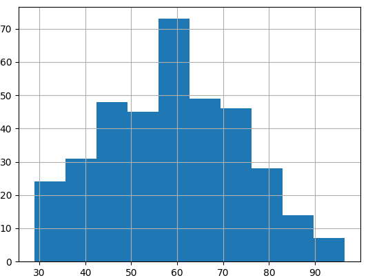
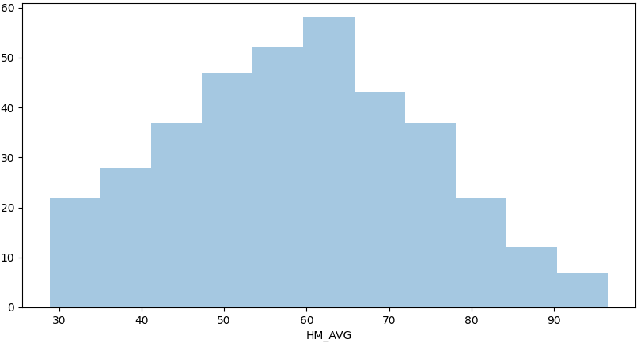
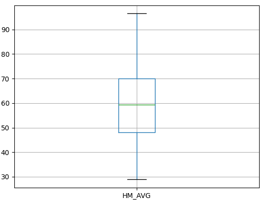

# python-data-analysis
python을 활용한 데이터 분석 실습

## 데이터 다루기
- 데이터 로드
```python
import pandas as pd
데이터명 =
pd.read_csv('파일경로/파일명.csv')
```

- 데이터 생성
```python
import pandas as pd

dictionary 파일명 =
{'컬럼명1': ['chr1','chr2','chr3'], '컬럼명2':[num1, num2, num3]}

데이터 프레임 파일명 =
pd.DataFrame(dictionary 파일명,index=['a','b','c','d','e'])
```

- 데이터 접근
```python
import pandas as pd

mydata['x1'].head()

mydata[1:5]['x1']

mydata.rename(columns={'x1':'item1'}, inplace=True)
```

- 데이터 저장
```python
import pandas as pd
데이터명.to_csv('파일을 저장할 경로/파일명.csv', 옵션)
```

## 데이터 탐색과 시각화
- 히스토그램
    - matplotlib
    
    - seaborn
    

- 박스 플롯
    